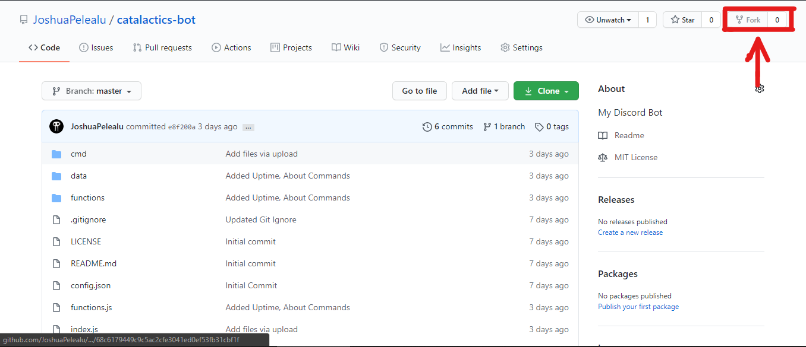
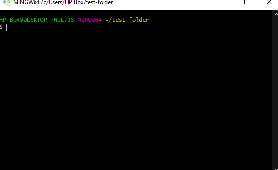
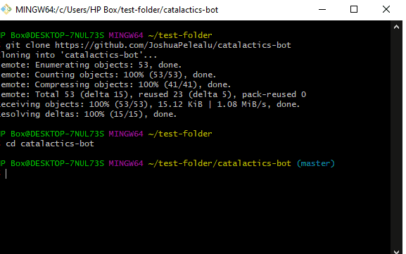
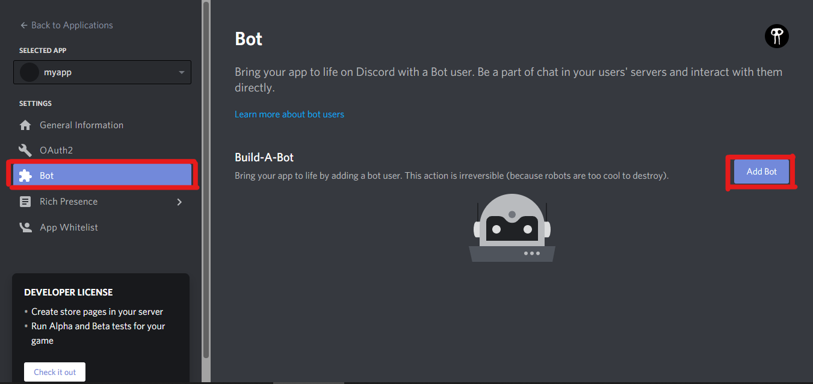
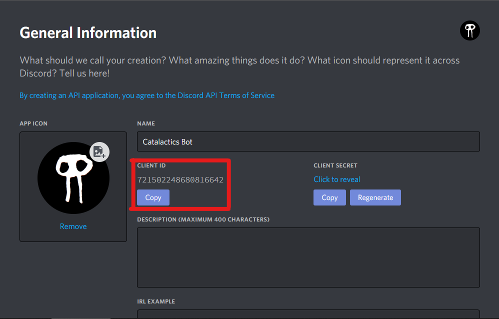
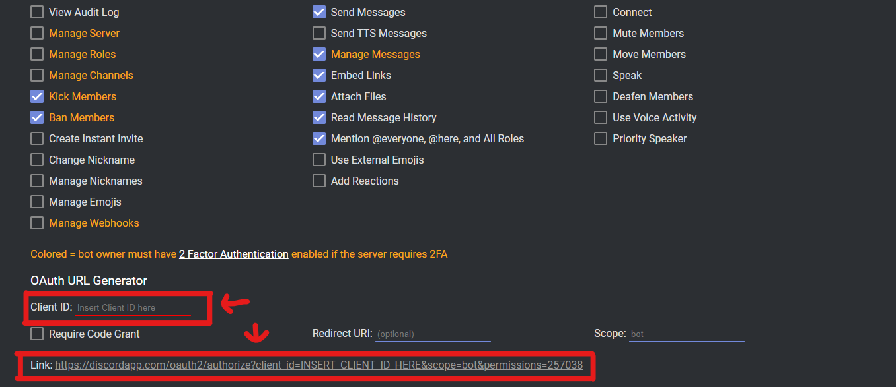
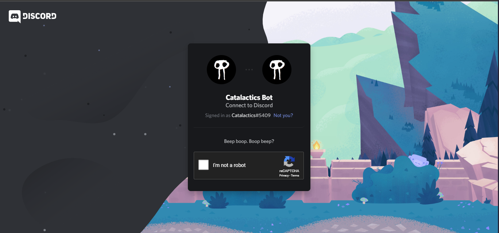
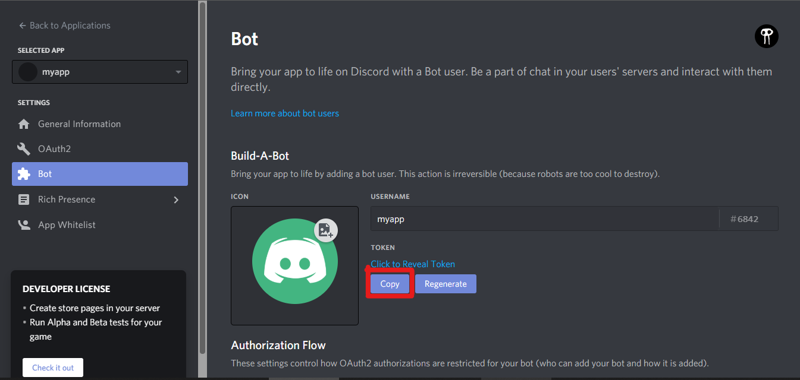
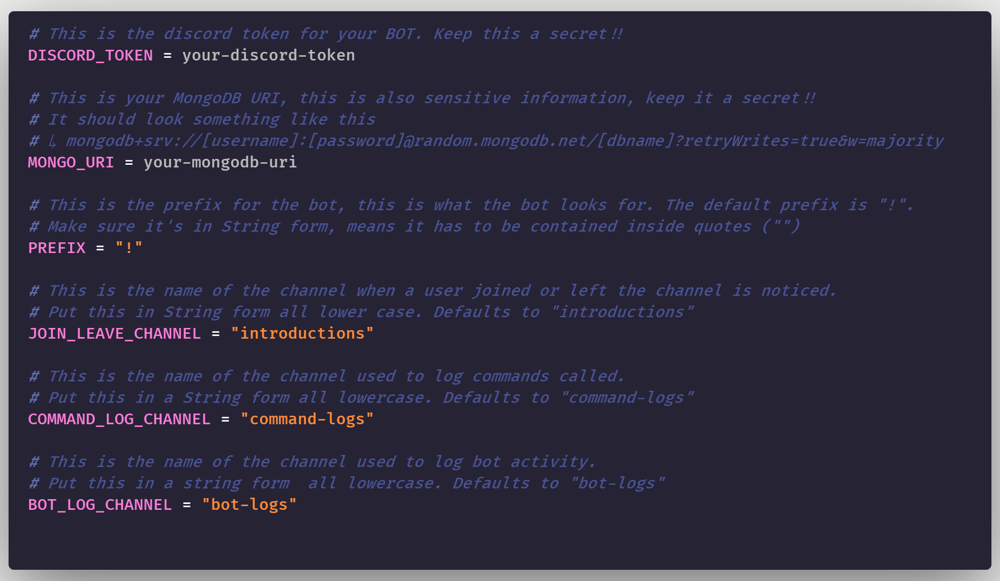

# Catalactics Bot


Welcome to my GitHub repository for my Discord Bot. This bot is MIT Licensed, that means you can use it as is, and there is not guarantee on the product. This project is open source and you can contribute on it, check [Contribute](#contributing).

## Contributing

You want to contribute on this Discord Bot, come along, let me tell you how:

1. [Install the necessary softwares.](#install-necessary-softwares) (Important)
2. Fork this repository.



3. Clone the forked repo to your local machine and cd to the directory. You can do so using this command in the git bash: `git clone https://github.com/Your-Username/catalactics-bot`. If you are using VSCode, you can use the Integrated terminal for this. Look at the full documentations for this.



4. Create a new branch



5. Make changes to the code. Add, update, or fix the code.
6. Test/debug your changes by running the bot locally.
7. Commit changes and then get a Pull Request (PR).

Thank you for contributing to this Repository.

## Install Necessary Softwares

If you're contributing, before doing anything else, install the following Softwares, these are the necessary tool to run this Bot:

| Software | Version | Additional Notes |
| - | - | - |
| Node.js | `12.x` | [Install Node.js](https://nodejs.org) |
| npm | `6.x` | Come bundled with Node.js. We used the bundled version, no LTS releases. |
| git | `2.x` | [Download Git](https://git-scm.com/) |
| MongoDB Compass* | `1.x` | [Download MongoDB Compass Community](https://www.mongodb.com/products/compass)<br/>This is not a required tool, this is just for database visualization. |

**Not Required / Optional*

You are also going to need to install a Code Editor if you do not have one already. There are a lot of them out there, but what we recommend are [Visual Studio Code](https://code.visualstudio.com) and [Atom Code Editor](https://atom.io). Either one of these two are good, pick which one you like.

## Getting the Bot into the Server

This bot requires the `Administrator` permission to run. We generated a link for you that will do that, all you need is a Client ID. Here's how you can get your bot up:

Go into the Discord's Website, then go to the Developer Portal and Sign in. You can use [this](https://discord.com/developers/applications) link.

1. Press the `New Application` button on the top right of the screen. Then give your application a name and press `Create`.
2. Select your new Application by clicking on it.
3. Go to the Bot section.
4. Press the Add Bot, and press Confirm



5. Go back to `General Information`.
6. Copy the Client ID.



7. Go to this [link](https://discordapi.com/permissions.html#257038), scroll down and enter in your client ID. Then Click on the link generated at the bottom.



8. Then it's going to ask which server you want the bot in. Pick the server you want and click Select. Then, It's going to show a form full of permissions, scroll down and click `Authorize`. Finish the captcha.



...and you're done, your bot should slide in to your server. There is still some stuff to do to get it running.

## Running It Locally

To run this bot locally, follow these steps:

1. Go to the folder where your cloned repo is.
2. Create a new file inside it called `.env`.
3. Inside the `.env` file, add your discord token like the example:

```
DISCORD_TOKEN=your-discord-token
```

You can get your discord token through the discord portal in the `Bot` section of your application.



4. Then inside the `.env` file, add a prefix like the example below (The default prefix is "!"). This is how you're going to call the bot later on. Ex:

   ```dotenv
   PREFIX="your-prefix"
   ```
5. Add another variable named `JOIN_LEAVE_CHANNEL` with a text channel where you want to log new user welcomes, the default channel is "introductions". Ex:

   ```dotenv
   JOIN_LEAVE_CHANNEL="introductions"
   ```
6. Add another variable named `COMMAND_LOG_CHANNEL` with a text channel where you want the bot to log the commands that were called, the default channel is "commmand-logs". Ex:

   ```dotenv
   COMMAND_LOG_CHANNEL="command-logs"
   ```
7. Add another variable named `BOT_LOG_CHANNEL` with a text channel where you want the bot to log when the bot is up/online, the default channel is "bot-logs". Ex:

   ```dotenv
   BOT_LOG_CHANNEL="bot-logs"
   ```


   This is what the whole `.env` would look like without the comments: 
8. Open up a terminal in the folder. (If you are using VSCode, you can press `CTRL + `` Shortcut)
9. Type the following command and hit enter:

```bash
npm i
```

10. Now, you can edit the code.
11. After you're done with that, type the following command and hit enter to run the bot:

```bash
node index
```

That's all. The bot should log an embed with the time it was woken up and account used inside the channel you specified inside the `.env` file with the variable `BOT_LOG_CHANNEL`. The default value is "bot-logs". If you don't have this channel, it will not log it.

## Commands Available
| Prefix | Description |
| :-: | :-: |
| ping | Pings the Bot, and it will reply with a message containing the Ping of the bot. |
| about | Give the BOT a little description of itself. They deserve some too. |
| help | Displays all of the commands available. If a command is specified, it will display the description of the command. That's this command |
| stats | Shows the status of the bot. |
| uptime | Shows the uptime of the bot |
| role | Advanced role command, additional arguments will change how it react. |
| roles | Gives a list of the roles and a little description of what they do |

## Dependencies

| Dependency | Version |
| :-: | :-: |
| [discord.js](https://discord.js.org) | `^12.2.0` |
| [dotenv](https://www.npmjs.com/package/dotenv) | `^8.2.0` |
| [mongoose](https://mongoosejs.com/) | `^3.5.9` |
| [mongodb](https://mongodb.com) | `^5.9.19` |

## Additional information

This project is for fun while providing a small service to everyone out there.

#### Need Help or You want me to set it up for you?

If you need help with anything or want me to set it up for you, you can contact me directly through any of the following:

Discord Server - [https://discord.gg/B3nRNez](https://discord.gg/B3nRNez)

Twitter - [@bigbrainfes](https://twitter.com/bigbrainfes)

Instagram - [@joshuahasian_04](https://www.instagram.com/joshuahasian_04/)

I would be happy to help you.

## Contributors

[Joshua Pelealu](https://github.com/JoshuaPelealu) - Repository Owner

Remember to Stay Safe and Happy Coding!!🙂

Catalactics
